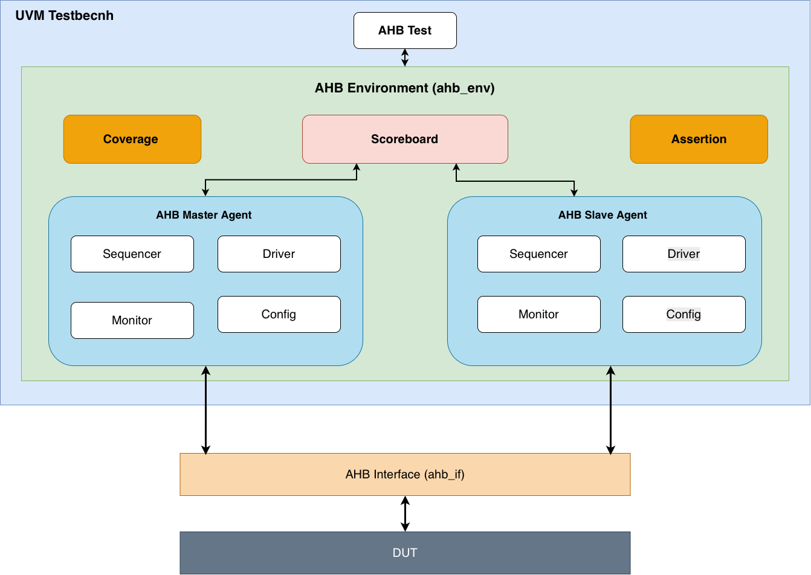
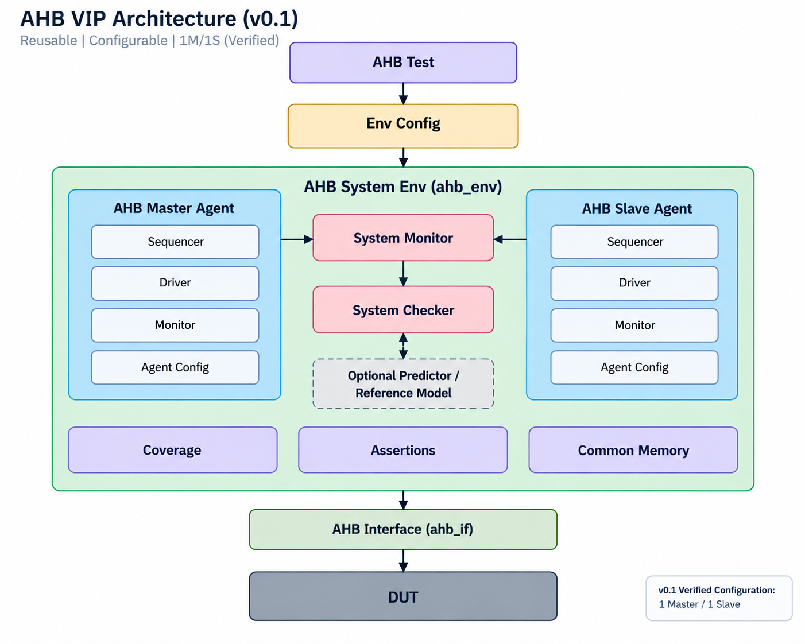

# FPT AHB VIP Architecture

## Principles

The VIP uses a direct UVM class-based architecture. Dynamic protocol behavior
belongs in UVM classes; static SystemVerilog is used for the interface,
testbench wiring, and SVA.

Do not introduce unnecessary Proxy, Converter, intermediate transport Struct,
or separate HDL BFM layers. Configuration and defaults support reuse, but the
architecture must not assume one particular DUT or memory behavior.

v0.0 is the frozen implementation baseline. v0.1 evolves its responsibility
boundaries before adding Full Burst + WAIT.

## Architecture Diagrams

The diagrams are visual summaries. The responsibility and ownership contracts
in this document remain authoritative if a diagram becomes stale.

### Frozen v0.0



The v0.0 diagram shows the implemented UVM testbench: AHB Test, Environment,
Master/Slave Agents, Scoreboard, Coverage, Assertion, AHB Interface, and DUT.

### Approved v0.1 Direction



The v0.1 diagram shows the reusable `1M / 1S` verified configuration with Env
Config, separate System Monitor and System Checker, optional Predictor /
Reference Model, Coverage, Assertions, Common Memory, AHB Interface, and DUT.

## System Structure

The reusable direction is:

```text
System Env
├── Env Config
├── Master Agent(s)
│   ├── Agent Config
│   ├── Sequencer
│   ├── Driver
│   └── Agent Monitor
├── Slave Agent(s)
│   ├── Agent Config
│   ├── Sequencer
│   ├── Driver
│   └── Agent Monitor
├── System Monitor
├── System Checker
└── optional Predictor / Reference Model
```

v0.1 functionally verifies one Master and one Slave. That is a verified
configuration, not a permanent architectural hardcode. Full routing,
arbitration, interconnect behavior, and functional multi-agent verification are
deferred.

## Environment and Configuration

The System Environment constructs and connects the configured components. Env
Config owns environment-level policy rather than scattering hardcoded behavior
through Agents, tests, or the example DUT.

Direct `fpt_ahb_env` consumers must provide `fpt_ahb_env_cfg`; the Environment
does not create a compatibility fallback configuration.

Env Config provides or coordinates:

- Master and Slave Agent configurations;
- configured topology;
- WAIT/performance policy;
- Checker enable/configuration;
- optional Predictor / Reference Model policy.

The implementation may prepare Agent configuration collections for future
reuse, but v0.1 creates and verifies only one Master and one Slave. No routing
table, arbiter, interconnect, or virtual sequencer is added without a concrete
approved need.

## Agent Responsibilities

### Master Agent

The Master Sequence supplies legal stimulus intent. The Master Driver converts
that intent into cycle-accurate AHB behavior and obtains READ data from `HRDATA`.
It must not access Slave common memory.

For v0.1, one Master sequence item represents one burst request. Configurable
stimulus fields may be declared `rand`; constraints and sequences select the
scenario, while Driver behavior enforces legal runtime progression.

### Slave Agent

The Slave Driver observes accepted request context and applies response policy
per active beat. WAIT policy, response timing, and common-memory access belong
to the Slave side, not to the transaction object or common-memory object.

A successful completed WRITE may update Slave common memory. A READ may obtain
response data from that memory. An incomplete or reset-aborted transfer must not
be committed.

### Agent Monitors

Master and Slave Agent Monitors reconstruct actual interface behavior
independently of Driver and Sequence intent. Each publishes one observation per
completed active beat.

They are responsible for:

- address/data pipeline tracking;
- actual response and data observation;
- actual WAIT-cycle measurement;
- burst metadata reconstruction needed by checking;
- clearing pending incomplete state on reset.

BUSY and IDLE are protocol observations but not completed data beats.

## System Monitor

System Monitor is separate from Agent Monitors and System Checker. Its system-
level observation boundary may add source, destination, routing-related
metadata, and transaction-level system context.

Full routing behavior is deferred. The current Scoreboard must not simply be
renamed to System Monitor because observation and checking have different
responsibilities.

## System Checker

The current v0.0 Scoreboard evolves toward a generic System Checker. It performs:

- Master/Slave observation matching;
- transaction integrity checking;
- generic data-integrity checking;
- burst type, beat count, and address progression checking;
- pending queue/matching behavior where required;
- a future boundary for routing-aware checking.

The Checker must not require every target to behave like normal memory. For the
verified v0.1 one-Master/one-Slave in-order configuration, one check unit is one
completed active beat. `expected_count` and `checked_count` remain counts of
completed active beats.

Random-stress transaction totals count Master burst-level sequence requests;
they do not change the Checker's completed-active-beat count semantics.

## Optional Predictor / Reference Model

Prediction is separate from generic checking. A Predictor / Reference Model may
provide expected READ data for a memory-like target, but it is optional and does
not define the System Checker architecture.

The independent reference-memory behavior used by v0.0 is preserved for
compatible tests while being separated from mandatory generic checking. Any
Predictor/reference state remains independent of Slave common memory.

## Common Memory

The Environment owns the Slave common-memory runtime object and shares its handle
only with Slave consumers. Consumers must not create private fallback instances.

Common memory provides storage only. It owns no clock, protocol timing, WAIT,
response, selection, or reset policy. The Slave common memory and optional
Predictor / Reference Model are separate objects with separate responsibilities.

## HTRANS and Burst Granularity

The v0.1 data contract is:

- Master sequence item: one burst request;
- Slave response policy: one active beat;
- Agent Monitor observation: one completed active beat;
- System Checker check/count unit: one completed active beat.

`HTRANS` may exist as useful transaction metadata or randomizable capability,
but runtime behavior must remain legal:

- first active beat is NONSEQ;
- subsequent active beats are SEQ;
- optional BUSY follows legal burst policy;
- an idle bus uses IDLE;
- BUSY and IDLE do not consume completed beats;
- low `HREADY` does not advance beat or address state.

Undefined-length INCR uses a finite, positive `num_beats`. Transaction-level
capability is bounded by the legal number of beats remaining before the AHB
1 KB boundary; there is no arbitrary architectural maximum of 16 beats.
Individual sequences or tests may constrain a smaller range, such as 2 through
16 beats, for a specific verification scenario. WORD-only burst progression
must enforce alignment, wrapping rules, and the AHB 1 KB boundary.

A shared generation helper may calculate burst addresses. Checker expected
progression must remain independently verifiable to avoid a common-mode false
PASS.

## HSEL Ownership

`HSEL` belongs to selection, decoder, or interconnect policy. The Master protocol
Driver does not own or drive it.

For the verified point-to-point v0.1 configuration, TB/top-level logic supplies
a simple selection policy and may tie the single Slave selected. The selected
Slave's `HREADYOUT` may feed bus `HREADY`; this is not a general multi-Slave
readiness solution.

## WAIT Ownership and Timing

WAIT is selected per active beat by Slave response policy. Supported modes are
ZERO_WAIT, FIXED_WAIT, and RANDOM_WAIT, with configurable fixed, minimum, and
maximum wait cycles.

While `HREADY` / `HREADYOUT` is low:

- address/control and pending transfer state follow AHB stability rules;
- beat and address state do not advance;
- no transfer is reported complete;
- no memory update occurs prematurely.

Agent Monitors measure WAIT from bus signals rather than copying Sequence intent.
WAIT timing must first be corrected and verified with SINGLE traffic before
burst integration.

## Reset and Compatibility

Basic reset during a burst aborts incomplete state, clears Driver/Monitor pending
state, prevents incomplete checking or memory commit, preserves already completed
transfers, and returns the bus to legal idle behavior.

Existing v0.0 ERROR enums and behavior remain for compatibility. ERROR
enhancement is outside v0.1; v0.1 burst/random signoff focuses on OKAY.

The active scope and implementation order are defined in `docs/V0_1_PLAN.md`.
Frozen v0.0 details remain in `docs/V0_0_TECHNICAL_OVERVIEW.md`.
